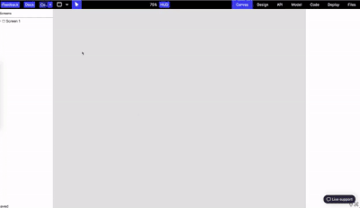
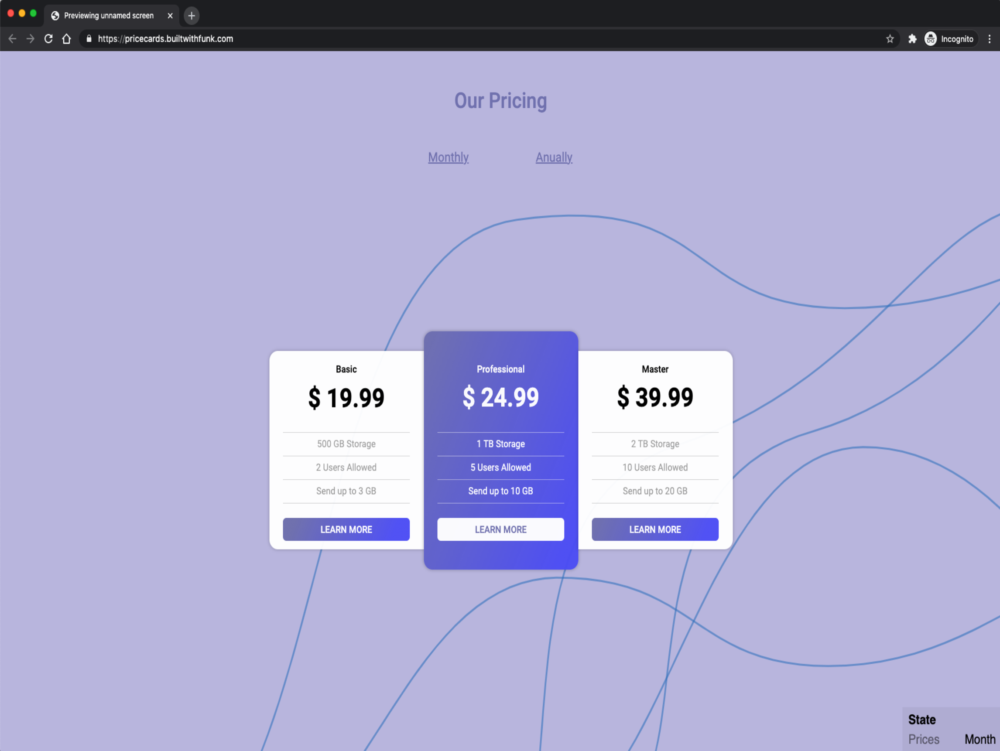
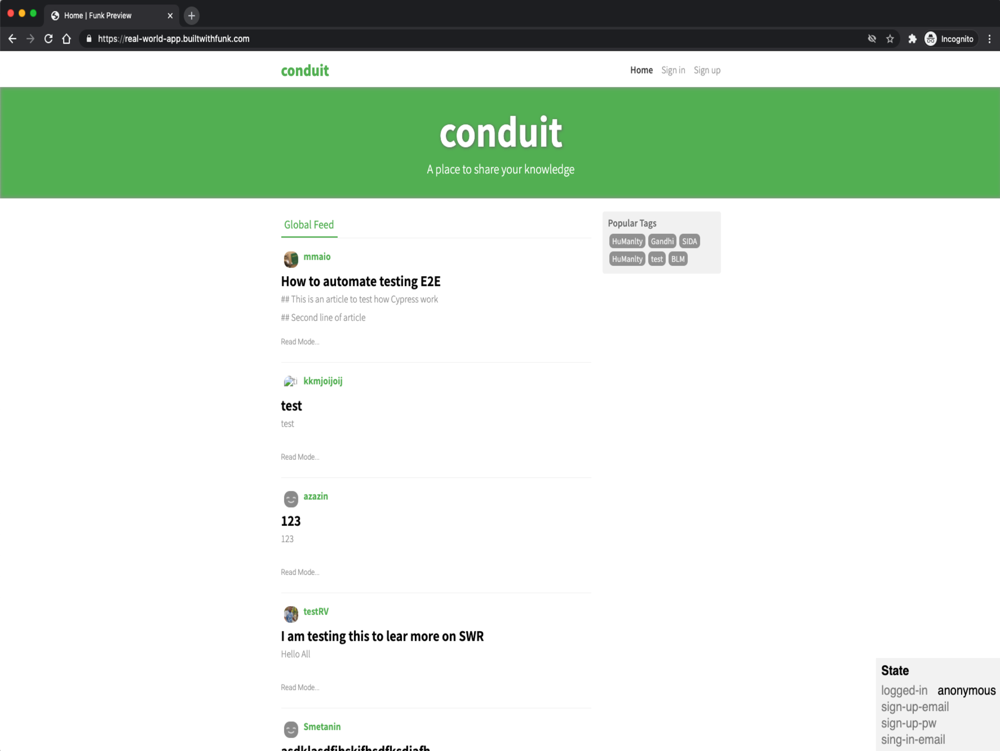
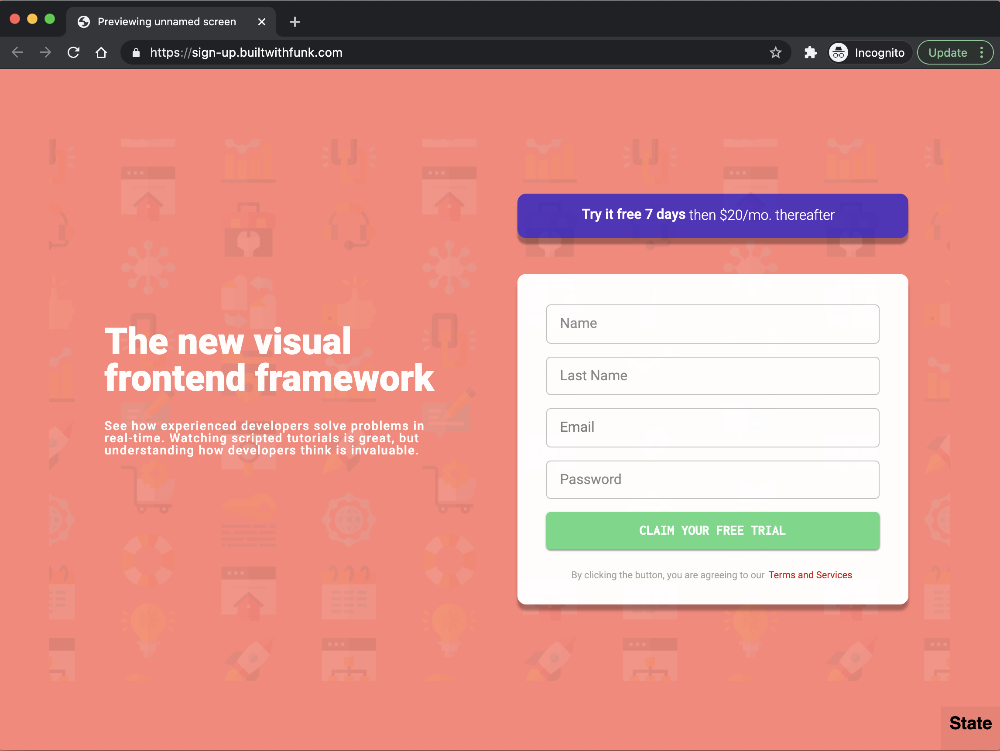
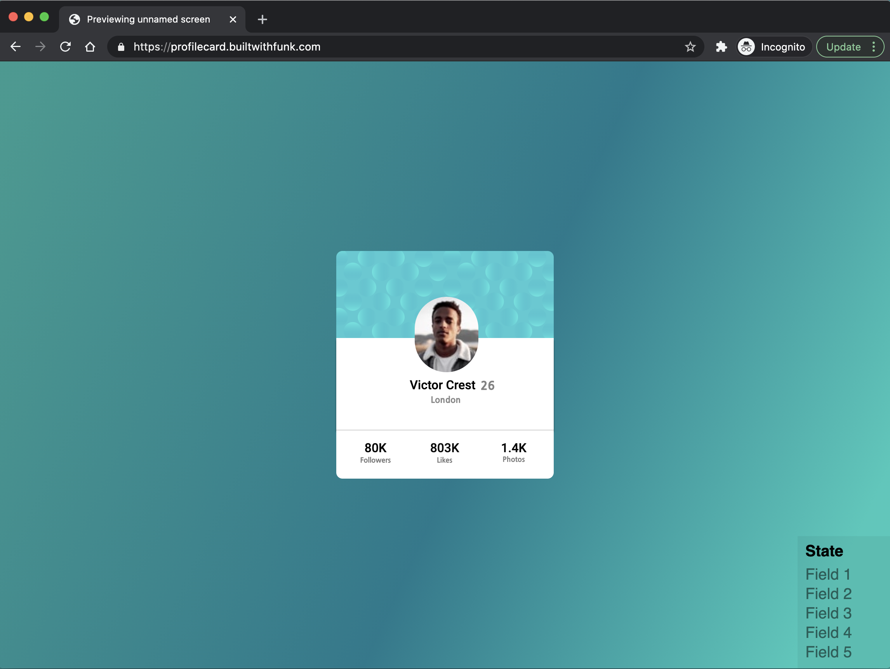
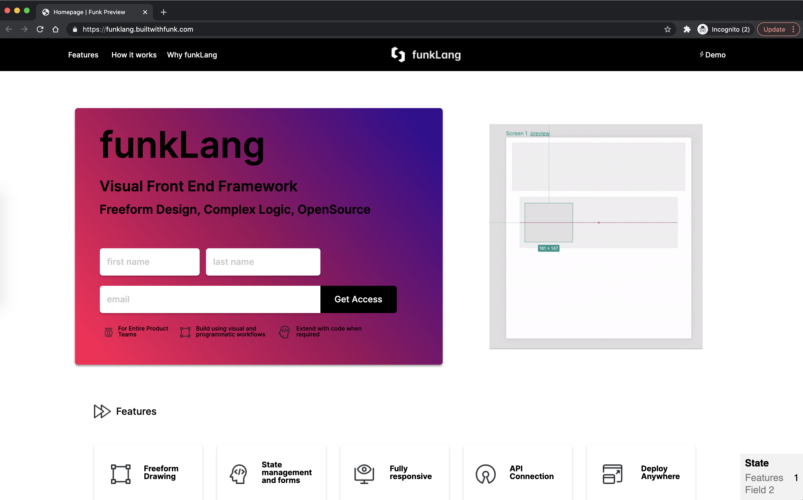
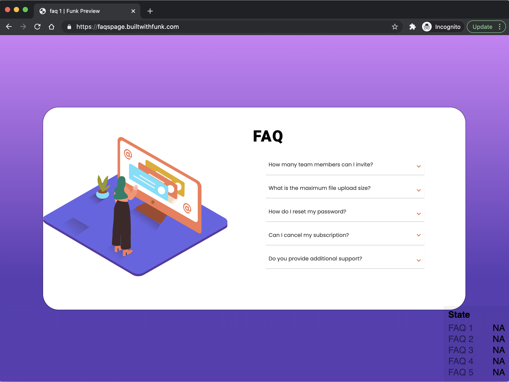

::warning:: FunkLang has been mothballed as of now, we are considering continuing developing Q4 2022. We turned off hosting. If you want to play with the project `git clone` and `npm start` it.
<!--
*** I'm using markdown "reference style" links for readability.
*** Reference links are enclosed in brackets [ ] instead of parentheses ( ).
*** See the bottom of this document for the declaration of the reference variables
*** for contributors-url, forks-url, etc. This is an optional, concise syntax you may use.
*** https://www.markdownguide.org/basic-syntax/#reference-style-links
-->

[![Contributors][contributors-shield]][contributors-url]
[![Stargazers][stars-shield]][stars-url]
[![GNU License][license-shield]][license-url]
[![Twitter][twitter-shield]][twitter-url]
[![slack][slack-shield]][slack-url]
[![reddit][reddit-shield]][reddit-url]

<!-- PROJECT LOGO -->
<br />
<p align="center">
  <a href="https://funklang.com">
    
  <p align="center">
<!--     <a href="https://editor.funklang.com">
      👉 Use the funkLang visual editor  👈
    </a> -->
  </p>
  <p align="center">
    Visual FrontEnd Framework - Design, Develop‍ and Deploy complex web applications using both code and visual workflows
    <br />
    <br />
    
  </p>
</p>

1. [About](#1-about)
2. [How funk works](#2-how-funk-works)
3. [Why we built funk](#3-why-we-built-funk)
4. [Contributing](#4-contributing)
5. [License](#5-license)
6. [Contact](#6-contact)

## 1. About

![funk-editor-screenshot][funk-editor-screenshot]

funkLang, or funk for short, is an open-source visual frontend framework where you can build complex stateful web applications using both code and visual workflows.

With funk visual and code workflows always stay in sync so designers, low-code users and developers can work alongside each other accelerating development. funk has a strong emphasis on **simplicity**, **collaboration**, and **freeform** design.

funk is currently in beta so bear with us, there is a lot to build, but we are committed to making funk succeed. You can help us on this journey by:

1. [Signing up, trying out funk and giving us feedback](https://editor.funklang.com)
2. [Contributing](#4-contributing) to the funk code base
3. Telling your friends about funk
4. Following us on [Twitter](https://twitter.com/FunkLng) and chatting to us on [Slack](https://join-slack.builtwithfunk.com/)
5. Starting us on GitHub

**If you are a business user (startup, agency, enterprise) and would like to discuss our roadmap or how funk can be used to replace existing proprietary tools (Mendix, OutSystems etc..) or how funk can be used alongside React, WordPress or VueJs please [book a call with us](https://calendly.com/david-beesley-funk/beta-program/?month=2021-02)**

### How funk is different

funk is **NOT** a templated web app builder such as Wix or WebFlow. funk enables freeform design of complex HTML layouts with internal bindings of state, data and navigation. We want funk to be as fully featured as WordPress, React or VueJs, but with a simple to use visual layer that can be extended with code when required.

funk brings the benefits of visual development to frontend teams of developers, designers and low-coders who need the power of an open-source frontend framework with the benefits of rapid visual development. Our vision is a tool where _everyone can collaborate together as equals using either code or visual workflows_.

## 2. How funk works

![Product Name Screen Shot][how-funk-works-screenshot]

## Project status

We are working towards version 1 of funkLang. Our aim is to be able to recreate the [Real World App](https://github.com/gothinkster/realworld/) within 6 months. We measured the below status of each part of funk against the requirements for the real-world app.

Check GH issues for details on what else we need to build to hit this milestone.

| funk          | Description                                                            | Status       | Docs                                 |
| ------------- | ---------------------------------------------------------------------- | ------------ | ------------------------------------ |
| Canvas        | Draw freeform responsive HTML                                          | 70% complete | [Canvas docs](docs/CANVAS.md)        |
| API editor    | Connect to external APIs                                               | 60% complete | [API docs](docs/API.md)              |
| Code Editor   | Transform data and feed into Canvas                                    | 70% complete | [Code editor docs](docs/CODE.md)     |
| Design system | Setup site-wide reusable styles                                        | 60% complete | [Design system docs](docs/DESIGN.md) |
| Model         | Set up the state of your site, this may include if a user is logged in | 50% complete | [Model docs](docs/MODEL.md)          |
| CLI           | Connect to the visual editor via a text editor                         | EXPERIMENTAL | [CLI docs](docs/CLI.md)              |
| Deploy        | Build funk apps, deploy anywhere                                       | 50% complete | [Deploy docs](docs/DEPLOY.md)        |

## Extending funk

You can connect the funk visual editor to your text editor using a CLI, changes are reflected between the two in real-time. This feature is presently experimental.

From your text editor you can add custom-elements to funk and eventually feed data to/from parts of funk created visually into your custom-element.

You can also write code to transform data within the funk visual environment. For instance, you could transform data from an API based on a users' location. You can import NPM packages using [SkyPack](https://www.skypack.dev/) directly in the editor.

## Code output

When you create an app in funk everything about your application is encoded in the funk spec, which at the moment is JSON. We want this to be readable and editable by developers.

The funk spec can be pushed to git, compiled to highly optimised HTML, Js and CSS at build time and deployed anywhere.

We don't output code for different frontend framework as it creates many problems such as low code quality, poor readability, difficult integration and breaking changes between visual and code environments. Some tools try to migrate these problems by creating CSS frameworks and their own state management engines. Building a visual layers on-top of fremaworks which are only designed for code workflows is always going to cause problems (trust us we tried). We want projects built with funk to be stable and performant - we don't believe this is possible by generating code for other frameworks.

## Built With funk

Here are some example sites we've built with funk, they were all built without the use of any CSS frameworks or templates. Soon you will be able to create more complex sites like password protected sites, dashboards and marketplaces.

**_These are our initial examples, soon you will be able to build much more complex sites with funk_**

<div>
  <a href="https://pricecards.builtwithfunk.com/"></a>
  <a href="https://real-world-app.builtwithfunk.com//"></a>
  <a href="https://sign-up.builtwithfunk.com/"></a>
  <a href="https://profilecard.builtwithfunk.com/"></a>
  <a href="https://funklang.builtwithfunk.com/"></a>
  <a href="https://faqpage.builtwithfunk.com/"></a>

</div>

## 3. Why we built funk

The founders of funk ([David Beesley](https://twitter.com/david_jb99) and [Jan Wirth](https://twitter.com/yung_wirth)) are both developers. We've worked for large enterprise and small startups. We built funk as we could see the benefits of low-code but were disappointed by the closed-source alternatives that are heavily templated, slow, expensive and generally treat developers like second class citizens. We saw very little innovation with existing tools and decided to build something radically different.

As we developed funk we became more convinced visual development is the way forward not just for low-code users but developers too. The productivity gains are massive as is the speed of innovation. We see visual development argumenting developers existing workflows allowing them to work faster and smarter in more diversely skilled teams.

## 4. Contributing

Contributions are what make the open source community such an amazing place to be learn, inspire, and create. Any contributions you make are **greatly appreciated**.

**The best way to get started is to book an onboarding call with a core funkLang contributor [Jan](https://koalendar.com/events/meet-with-yung-wirth)**

1. Fork the Project
2. Create your Feature Branch (`git checkout -b gh-123-my-feature` or `git checkout -b no-issue-refactor-something`)
3. Commit your Changes (`git commit -m 'GH-123: Add my feature'` or `git commit -m 'no-issue: Refactor something'`)
4. Push to the Branch (`git push origin no-issue-refactor-something`)
5. Open a Pull Request

### Installation and Starting the project

This project runs on node. We develop funk using node version 15.

```sh
git clone git@github.com:funk-team/funkLang.git
cd funkLang
npm install

# run development environment
npm start

# run unit tests
npm run tdd-elm

```

## 5. License

funkLang is distributed under the GNU v3 License. See `LICENSE` for more information. We choose this licence as it's used by some of the most successful open-source projects in the world, including WordPress.

Software licensed with any GNU license can be used and even modified everywhere, including in a corporate environment, without any restrictions. However be aware that if you (or the company) ever make changes to the funkLang and want to distribute it, it must be distributed with full source code, on the same license terms as the original software [source](https://opensource.stackexchange.com/a/1400).

We choose GNU to ensure funkLang always remains free and open. Code which funkLang outputs and extensions you build for funkLang can be licensed using any licence you wish. If you have any questions about the licence please contact us.

<!-- CONTACT -->

## 6. Contact

You can reach us using the following social channels:

Twitter

-   [funkLang](https://twitter.com/funklng)
-   [David Beesley](https://twitter.com/david_jb99)
-   [Jan Wirth](https://twitter.com/yung_wirth)

LinkedIn

-   [David Beesley](https://www.linkedin.com/in/davidjbeesley/)
-   [Jan Wirth](https://www.linkedin.com/in/janwirth/)

If you ever want to chat about life, love or funk, book a video call with [David](https://calendly.com/david-beesley-funk/beta-program/) or [Jan](https://koalendar.com/events/meet-with-jan-wirth) anytime you want.

<!-- ACKNOWLEDGEMENTS -->

## Acknowledgements

funk would not be possible without [Evan Czaplicki](https://twitter.com/evancz) the creator of [Elm](https://elm-lang.org/) and [Matthew Griffith](https://twitter.com/mech_elephant) the ceater of [Elm-ui](https://package.elm-lang.org/packages/mdgriffith/elm-ui/latest/)

We are grateful for the support of the German government who provided financing via the [EXIST](https://www.exist.de/EN/Home/home_node.html) program and [Beuth Uochschule University](https://www.beuth-hochschule.de/) for hosting us during our research grant.

<!-- MARKDOWN LINKS & IMAGES -->
<!-- https://www.markdownguide.org/basic-syntax/#reference-style-links -->

[contributors-shield]: https://img.shields.io/github/contributors/funk-team/funkLang?style=flat
[contributors-url]: https://github.com/funk-team/funkLang
[stars-shield]: https://img.shields.io/github/stars/funk-team/funkLang?style=flat
[stars-url]: https://github.com/funk-team/funkLang
[license-shield]: https://img.shields.io/github/license/funk-team/funkLang?style=flat
[license-url]: https://github.com/funk-team/funkLang/blob/master/LICENSE
[slack-shield]: https://img.shields.io/badge/-Slack-black.svg?style=flat&logo=slack&colorB=555
[slack-url]: https://join-slack.builtwithfunk.com/
[twitter-shield]: https://img.shields.io/twitter/follow/funklng?label=Twitter&logo=twitter&style=flat
[twitter-url]: https://twitter.com/FunkLng
[twitter-shield-simple]: https://img.shields.io/twitter/url?label=Twitter&style=social&url=funklng
[twitter-url-simple]: https://twitter.com/FunkLng
[reddit-shield]: https://img.shields.io/reddit/subreddit-subscribers/funkLang?label=Reddit&style=flat
[reddit-url]: https://www.reddit.com/r/funkLang/comments/l0rin6/rfunklang_lounge/

<!-- IMAGES -->

[funk-editor-screenshot]: docs/images/funk-canvas-overview.png
[how-funk-works-screenshot]: docs/images/how-funk-works.png
[image-faq]: docs/images/funk-faq-page.png
[image-login]: docs/images/funk-login.page.png
[image-profile]: docs/images/funk-profile-page.png
[image-homepage]: docs/images/funk-home-page.png
